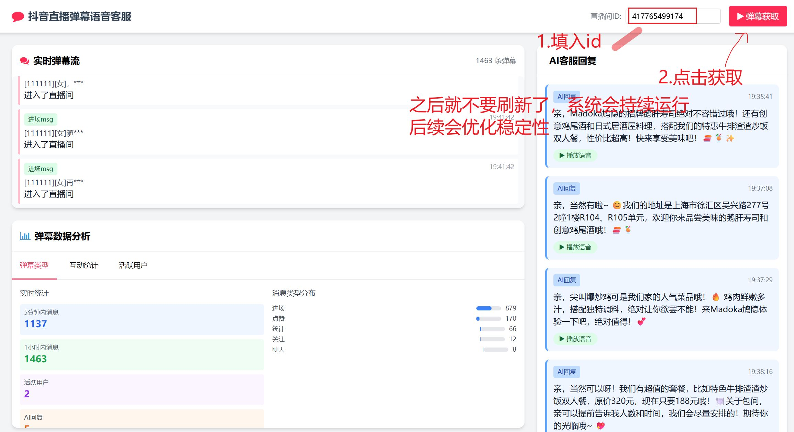

# TkVoiceJourney - 抖音直播弹幕语音客服系统

## 📖 项目简介

TkVoiceJourney 是一个集成实时弹幕获取、AI智能判断、TTS语音合成的现代化抖音直播弹幕语音客服系统。该系统能够实时监控抖音直播间弹幕，通过AI模型智能筛选有价值的用户消息，自动生成回复并转换为语音播放。

## ✨ 核心功能

### 🎯 主要特性
- **实时弹幕获取** - 连接抖音直播间，实时抓取各类弹幕数据（聊天、礼物、点赞、进场等）
- **智能AI判断** - 使用OpenAI/Claude等API或本地AI模型筛选有价值弹幕并生成智能回复
- **TTS语音合成** - 基于Fish-Speech-API实现高质量文本转语音功能
- **Web可视化界面** - 现代化响应式Web界面，实时显示弹幕流和AI回复
- **数据分析统计** - 弹幕类型分布、用户互动统计、实时数据可视化
- **GUI桌面应用** - 提供PySide6和Tkinter两种桌面界面版本

### 🏗️ 技术架构
- **前端界面**: HTML + TailwindCSS + JavaScript / PySide6 / Tkinter
- **后端服务**: FastAPI + WebSocket + 异步编程
- **AI模型**: OpenAI API / Claude API / 本地Qwen模型
- **TTS引擎**: Fish-Speech-API
- **弹幕获取**: 抖音直播WebSocket协议解析

## 🚀 快速开始

### 环境要求
- Python 3.8+
- Windows 10+ (推荐)
- 稳定的网络连接

### 1. 克隆项目
```powershell
git clone https://github.com/Wu-ChengLiang/TkVoiceJourney.git
cd TkVoiceJourney
```

### 2. 安装依赖
```powershell
# 安装基础依赖
pip install websocket-client betterproto

# 激活虚拟环境（如果有）
.\tkvj\Scripts\activate

# 安装完整依赖
cd app
pip install -r requirements.txt
```

### 3. 配置环境变量
复制配置文件并编辑：
```powershell
copy .env.example .env
```

编辑 `.env` 文件，配置API密钥：
```env
# AI API配置（选择一种）
AI_API_TYPE=openai
AI_API_KEY=sk-your-openai-api-key
AI_API_BASE=https://api.openai.com/v1
AI_MODEL_NAME=gpt-3.5-turbo

# Fish Audio TTS配置
FISH_API_KEY=your_fish_api_key
FISH_REFERENCE_ID=your_reference_id
```

### 4. 启动应用

#### Web界面版本（推荐，后续在考虑应用端）
```powershell
# 使用项目根目录启动脚本
cd app
python run.py

```
  启动后访问: http://localhost:8000



```

## 📁 项目结构

```
TkVoiceJourney/
├── README.md                    # 项目说明文档
├── run.py                       # 主启动脚本
├── .env                         # 环境配置文件
│
├── app/                         # Web应用主目录
│   ├── main.py                  # FastAPI主应用
│   ├── barrage_fetcher.py       # 弹幕获取模块
│   ├── ai_judge_simple.py       # AI判断模块
│   ├── ai_reply.py              # AI回复生成
│   ├── tts_client.py            # TTS客户端
│   ├── data_analytics.py        # 数据分析模块
│   ├── config.py                # 配置管理
│   ├── requirements.txt         # Python依赖
│   ├── templates/               # HTML模板
│   ├── static/                  # 静态资源
│   └── data/                    # 数据存储
│
├── fish-speech-api/             # TTS语音合成API
│   ├── src/                     # 源代码
│   ├── output/                  # 音频输出
│   └── requirements.txt         # GUI依赖
│
├── Fetcher/                     # 弹幕获取核心
│   ├── liveMan.py               # 直播弹幕抓取
│   ├── sign.js                  # 签名算法
│   └── protobuf/                # 协议缓冲区定义
│
├── tests/                       # 测试文件

```

## 🎯 使用指南

### 界面预览


### Web界面操作
1. **启动服务** - 运行 `python run.py` 启动Web服务
2. **输入直播间ID** - 在顶部输入抖音直播间ID（如：37002227641）
3. **开始监控** - 点击"开始弹幕获取"按钮
4. **查看弹幕** - 左侧实时显示各类弹幕消息
5. **AI自动回复** - 右侧显示AI筛选的弹幕和生成的语音回复
6. **手动回复** - 底部可手动输入文本生成语音

### 弹幕类型说明
- 🟦 **聊天msg** - 用户发送的聊天消息
- 🟩 **进场msg** - 用户进入直播间提示
- 🟪 **礼物msg** - 用户送礼物消息
- 🟥 **点赞msg** - 用户点赞消息
- 🟨 **关注msg** - 用户关注主播消息
- ⬜ **统计msg** - 在线人数等统计信息

### GUI界面操作
- **PySide6版本** - 现代化Material Design风格界面
- **Tkinter版本** - 轻量级传统桌面界面
- **音频保存** - 生成的语音自动保存到output目录
- **快捷键** - Ctrl+Enter快速发送消息

## ⚙️ 配置说明

### AI模型配置
支持多种AI API：
```env
# OpenAI API
AI_API_TYPE=openai
AI_API_KEY=sk-xxx
AI_MODEL_NAME=gpt-3.5-turbo

# Claude API  
AI_API_TYPE=claude
AI_API_KEY=claude-xxx
AI_MODEL_NAME=claude-3-sonnet

# vLLM本地部署
AI_API_TYPE=vllm
AI_API_BASE=http://localhost:8000/v1
```

### TTS配置
```env
# Fish Audio API
FISH_API_KEY=your_fish_api_key
FISH_REFERENCE_ID=your_reference_id
TTS_MODEL=s1-mini
```

### 弹幕获取配置
- **真实模式** - 连接真实抖音直播间
- **测试模式** - 使用模拟弹幕数据进行开发测试

## 📊 功能模块详解

### 1. 弹幕获取模块 (`Fetcher/`)
- 基于抖音直播WebSocket协议
- 支持protobuf消息解析
- 实时获取多种类型弹幕数据
- 自动签名算法处理

### 2. AI判断模块 (`app/ai_judge_simple.py`)
- 智能筛选有价值弹幕
- 生成个性化AI回复
- 支持多种AI模型切换
- 可配置过滤规则

### 3. TTS语音合成 (`fish-speech-api/`)
- 高质量语音合成
- 支持多种音色选择
- WebSocket流式传输
- 音频文件自动保存

### 4. 数据分析 (`app/data_analytics.py`)
- 实时弹幕统计
- 用户互动分析
- 数据可视化图表
- 历史数据存储

## 🔧 开发指南

### API端点
- `GET /` - 主页面
- `POST /api/start_live` - 开始监控直播间
- `POST /api/stop_live` - 停止监控  
- `POST /api/manual_reply` - 手动回复
- `GET /api/barrage_data` - 获取弹幕数据
- `WebSocket /ws` - 实时通信

### WebSocket消息格式
```json
{
  "type": "barrage|ai_reply|manual_reply",
  "data": {
    "content": "消息内容",
    "user": "用户信息",
    "timestamp": 1234567890
  }
}
```

### 添加新功能
1. 在对应模块目录下创建新文件
2. 实现功能逻辑和API接口
3. 更新前端界面和路由
4. 添加相应的测试用例

## 🐛 故障排除

### 常见问题

**1. 弹幕获取失败**
- 检查直播间ID是否正确且直播中
- 确认网络连接稳定
- 尝试使用测试模式验证功能

**2. AI API调用失败**
- 验证API密钥配置正确
- 检查API余额和调用限制
- 确认网络能访问API服务

**3. TTS语音生成失败**
- 检查Fish Audio API配置
- 确认音频输出目录权限
- 测试网络连接状态

**4. Web界面无法访问**
- 确认服务启动成功（查看控制台输出）
- 检查端口8000是否被占用
- 尝试清除浏览器缓存

### 调试模式
启用详细日志输出：
```python
import logging
logging.basicConfig(level=logging.DEBUG)
```

## 📄 许可证与声明

本项目仅供学习和研究使用，请遵守相关平台的服务条款。

## 🤝 贡献指南

欢迎提交Issue和Pull Request！
1. Fork本项目
2. 创建功能分支
3. 提交变更
4. 发起Pull Request

## 📞 技术支持

- **项目仓库**: https://github.com/Wu-ChengLiang/TkVoiceJourney
- **问题反馈**: 通过GitHub Issues提交
- **开发交流**: 欢迎Star和Fork

---

> 💡 **提示**: 首次使用建议先在测试模式下熟悉功能，然后再连接真实直播间使用。
