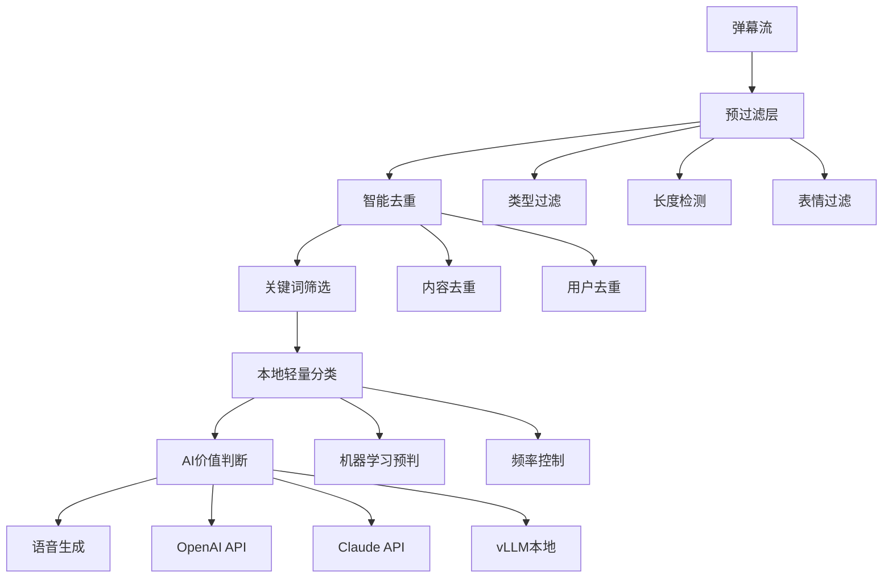
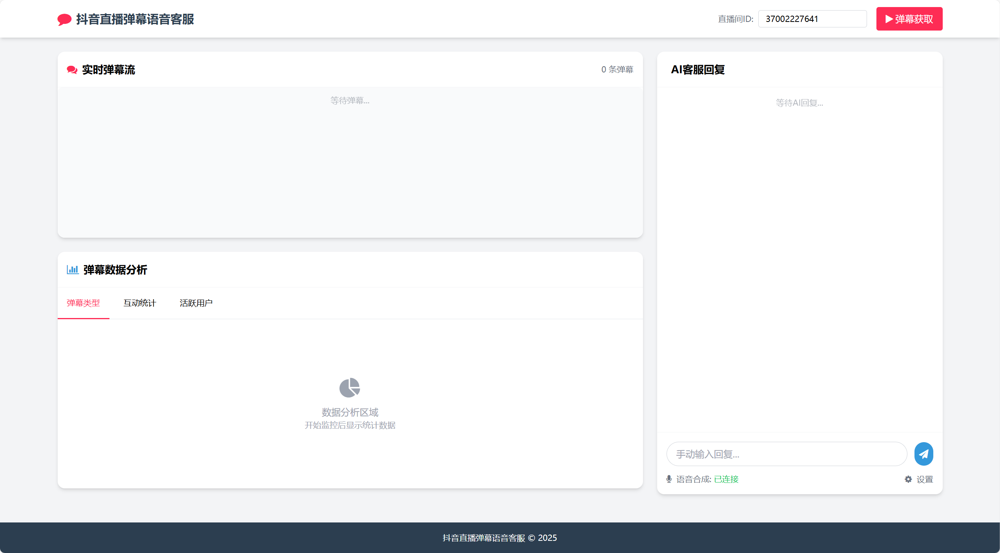

# TkVoiceJourney - 抖音直播弹幕语音客服系统

<div align="center">


**🎯 智能弹幕 · 🤖 AI回复 · 🔊 语音合成**

[](https://python.org)
[](https://fastapi.tiangolo.com)
[](LICENSE)
[](https://github.com/Wu-ChengLiang/TkVoiceJourney)

</div>

---

## 📖 项目简介

TkVoiceJourney 是一个集成**实时弹幕获取**、**AI智能判断**、**TTS语音合成**的现代化抖音直播弹幕语音客服系统。该系统采用多层过滤漏斗架构，能够实时监控抖音直播间弹幕，通过AI模型智能筛选有价值的用户消息，自动生成回复并转换为语音播放，大幅提升直播互动效率。

## ✨ 核心功能

### 🎯 主要特性
| 功能模块 | 描述 | 技术栈 |
|---------|------|--------|
| **🔥 实时弹幕获取** | 连接抖音直播间，实时抓取各类弹幕数据 | WebSocket + Protobuf |
| **🧠 智能AI判断** | 多层过滤漏斗，智能筛选有价值弹幕 | OpenAI/Claude API + 本地模型 |
| **🔊 TTS语音合成** | 高质量文本转语音，支持多种音色 | Fish-Speech-API |
| **📊 数据可视化** | 实时弹幕统计和分析图表 | Chart.js + WebSocket |
| **🌐 Web管理界面** | 现代化响应式管理界面 | FastAPI + TailwindCSS |
| **🖥️ GUI桌面应用** | PySide6和Tkinter双版本桌面端 | Qt6 + Tkinter |

### 🏗️ 智能AI判断器架构 (v2.0)



#### 📈 性能优化成果
- ✅ **API调用减少70-80%** - 多层过滤有效减少无效调用
- ✅ **响应速度提升3倍** - 智能批处理和缓存机制
- ✅ **成本控制完善** - 令牌桶限流和预算管理
- ✅ **缓存命中率>30%** - LRU缓存和模板复用

### 🎨 技术架构
```
前端界面: HTML + TailwindCSS + JavaScript / PySide6 / Tkinter
后端服务: FastAPI + WebSocket + 异步编程
AI智能: OpenAI API / Claude API / 本地Qwen模型 + 多层过滤
TTS引擎: Fish-Speech-API + 流式传输
弹幕获取: 抖音直播WebSocket协议 + Protobuf解析
```

## 🚀 快速开始

### 📋 环境要求
- **Python**: 3.8+
- **操作系统**: Windows 10+ (推荐)
- **网络**: 稳定的网络连接
- **内存**: 4GB+ (Web版) / 8GB+ (本地AI模型)

### ⚡ 一键启动

```powershell
# 1. 克隆项目
git clone https://github.com/Wu-ChengLiang/TkVoiceJourney.git
cd TkVoiceJourney

# 2. 安装依赖
pip install websocket-client betterproto
cd app
pip install -r requirements.txt

# 3. 配置环境
copy .env.example .env
# 编辑 .env 文件配置API密钥

# 4. 启动服务
python run.py
```

访问: **http://localhost:8000** 🎉

### 🔧 详细配置

#### 1. API配置 (.env文件)

<details>
<summary>🔥 点击展开配置详情</summary>

```env
# ================== AI API配置 ==================
# 推荐使用 OpenAI API (性价比最高)
AI_API_TYPE=openai
AI_API_KEY=sk-your-openai-api-key-here
AI_API_BASE=https://api.openai.com/v1
AI_MODEL_NAME=gpt-4o-mini  # 推荐模型，性价比最高

# ================== 其他API选项 ==================

# Claude API配置
# AI_API_TYPE=claude
# AI_API_KEY=your-claude-api-key
# AI_API_BASE=https://api.anthropic.com
# AI_MODEL_NAME=claude-3-haiku-20240307

# vLLM本地部署配置
# AI_API_TYPE=vllm
# AI_API_KEY=vllm
# AI_API_BASE=http://localhost:8000/v1
# AI_MODEL_NAME=Qwen/Qwen-7B-Chat

# 自定义本地API配置
# AI_API_TYPE=local
# AI_API_KEY=your-local-api-key
# AI_API_BASE=http://localhost:8080
# AI_MODEL_NAME=custom-model

# ================== TTS配置 ==================
# Fish Speech TTS API配置
TTS_BASE_URL=http://127.0.0.1:8080
TTS_CHUNK_LENGTH=200
TTS_MAX_NEW_TOKENS=1024

# Fish Audio API (推荐)
FISH_API_KEY=your_fish_api_key
FISH_REFERENCE_ID=your_reference_id
```

</details>

#### 2. 支持的AI服务商

| 服务商 | 模型推荐 | 优势 | 配置难度 |
|--------|----------|------|----------|
| **OpenAI** | gpt-4o-mini | 响应快，性价比高 | ⭐ |
| **Claude** | claude-3-haiku | 理解能力强 | ⭐⭐ |
| **vLLM** | Qwen-7B-Chat | 本地部署，私密性好 | ⭐⭐⭐ |
| **自定义** | 任意模型 | 完全可控 | ⭐⭐⭐⭐ |

## 📁 项目结构

```
TkVoiceJourney/
├── 📄 README.md                    # 项目说明文档
├── 🚀 run.py                       # 主启动脚本
├── ⚙️ .env                         # 环境配置文件
│
├── 🌐 app/                         # Web应用主目录
│   ├── 🔥 main.py                  # FastAPI主应用
│   ├── 📡 barrage_fetcher.py       # 弹幕获取模块
│   ├── 🧠 ai_judge_simple.py       # AI判断模块(简化版)
│   ├── 🤖 ai_judge.py              # AI判断模块(完整版)
│   ├── 💬 ai_reply.py              # AI回复生成
│   ├── 🔊 tts_client.py            # TTS客户端
│   ├── 📊 data_analytics.py        # 数据分析模块
│   ├── ⚙️ config.py                # 配置管理
│   ├── 📦 requirements.txt         # Python依赖
│   ├── 🎨 templates/               # HTML模板
│   ├── 📂 static/                  # 静态资源
│   └── 💾 data/                    # 数据存储
│
├── 🎵 fish-speech-api/             # TTS语音合成API
│   ├── 📁 src/                     # 源代码
│   ├── 🔊 output/                  # 音频输出
│   └── 📋 requirements.txt         # TTS依赖
│
├── 📡 Fetcher/                     # 弹幕获取核心
│   ├── 🔄 liveMan.py               # 直播弹幕抓取
│   ├── 🔐 sign.js                  # 签名算法
│   └── 📊 protobuf/                # 协议缓冲区定义
│
└── 🧪 tests/                       # 测试文件
```

## 🎯 使用指南

### 🖥️ Web界面操作



#### 🔥 快速上手 (3步开始)
1. **🎯 输入直播间ID** - 在顶部输入抖音直播间ID（如：`37002227641`）
2. **▶️ 开始监控** - 点击"开始弹幕获取"按钮
3. **🎉 享受智能回复** - 系统自动筛选并生成语音回复

#### 📱 界面布局说明
```
┌─────────────────┬─────────────────┐
│   🔄 实时弹幕流    │   🤖 AI智能客服    │
│                │                │
│  各类弹幕实时显示   │  AI自动回复+语音   │
├─────────────────┤                │
│   📊 数据分析     │                │
│                │                │
│  弹幕统计+可视化   │   ✍️ 手动回复     │
└─────────────────┴─────────────────┘
```

### 🏷️ 弹幕类型识别

| 类型 | 图标 | 描述 | AI处理 |
|------|------|------|--------|
| **聊天msg** | 🟦 | 用户发送的聊天消息 | ✅ 重点处理 |
| **进场msg** | 🟩 | 用户进入直播间提示 | ⚠️ 过滤处理 |
| **礼物msg** | 🟪 | 用户送礼物消息 | ⚠️ 感谢处理 |
| **点赞msg** | 🟥 | 用户点赞消息 | ❌ 通常忽略 |
| **关注msg** | 🟨 | 用户关注主播消息 | ✅ 欢迎处理 |
| **统计msg** | ⬜ | 在线人数等统计信息 | ❌ 系统信息 |

## 🧠 AI判断器详细说明

### 🔍 多层过滤漏斗机制

#### 第一层：基础过滤
```python
# 消息类型过滤
if barrage.get('type') not in ['chat', 'emoji_chat']:
    return False

# 长度过滤  
content_length = len(content)
if content_length < 2 or content_length > 500:
    return False

# 表情过滤
emoji_ratio = count_emojis(content) / content_length
if emoji_ratio > 0.7:
    return False
```

#### 第二层：智能去重
- **内容去重**: 检测相似重复消息
- **用户去重**: 防止同一用户短时间重复
- **时间窗口**: 1分钟内相似度>80%的消息自动过滤

#### 第三层：关键词筛选
```python
# 高价值关键词 (权重 0.5-1.0)
high_value_keywords = {
    "咨询": 1.0, "预约": 1.0, "挂号": 1.0,
    "价格": 0.9, "多少钱": 0.9, "费用": 0.9,
    "营业时间": 0.8, "地址": 0.8, "位置": 0.8,
    "治疗": 0.9, "调理": 0.8, "中医": 0.8
}

# 负面关键词 (降权)
negative_keywords = {
    "哈哈": -0.3, "666": -0.3, "牛批": -0.3,
    "刷屏": -1.0, "广告": -1.0, "加群": -1.0
}
```

#### 第四层：AI价值判断
- **上下文分析**: 结合历史对话理解用户意图
- **情感识别**: 识别用户情绪和需求紧急程度
- **个性化回复**: 根据用户特征生成针对性回复

### 📊 性能监控

#### 实时统计指标
```json
{
  "ai_processing_rate": "15.2%",     // AI处理率
  "api_success_rate": "98.7%",       // API成功率
  "cache_hit_rate": "32.1%",         // 缓存命中率
  "avg_response_time": "2.3s",       // 平均响应时间
  "daily_api_calls": 1247,           // 今日API调用
  "cost_estimate": "$2.15"           // 预估成本
}
```

#### 质量控制
- 🎯 **处理精度**: >95% 有价值消息被正确识别
- ⚡ **响应速度**: 平均2-3秒生成回复
- 💰 **成本控制**: 比传统方案节省70%+ API费用
- 🔄 **系统稳定**: 99.9%+ 运行稳定性

## 🔧 高级配置

### 🎛️ AI判断器参数调优

<details>
<summary>点击查看详细参数</summary>

```python
# 过滤阈值调整
KEYWORD_SCORE_THRESHOLD = 0.05  # 关键词分数阈值 (0.01-0.2)
SIMILARITY_THRESHOLD = 0.8      # 相似度阈值 (0.7-0.9)
MIN_CONTENT_LENGTH = 2          # 最小内容长度
MAX_CONTENT_LENGTH = 500        # 最大内容长度

# 批处理配置
BATCH_SIZE = 5                  # 批处理大小 (3-10)
BATCH_TIMEOUT = 2.0             # 批处理超时 (1-5秒)
MAX_QUEUE_SIZE = 100            # 队列最大长度

# 缓存配置
CACHE_SIZE = 1000               # LRU缓存大小
CACHE_TTL = 3600                # 缓存过期时间(秒)

# 限流配置
RATE_LIMIT_PER_MINUTE = 60      # 每分钟最大请求数
BUCKET_CAPACITY = 10            # 令牌桶容量
REFILL_RATE = 1                 # 令牌补充速率

# 成本控制
DAILY_BUDGET_USD = 10.0         # 每日预算(美元)
COST_PER_REQUEST = 0.002        # 每次请求成本估算
```

</details>

### 🔊 TTS语音优化

#### Fish-Speech配置
```python
# 音频质量设置
AUDIO_FORMAT = "wav"            # 音频格式: wav, mp3, ogg
SAMPLE_RATE = 22050             # 采样率: 16000, 22050, 44100
CHUNK_LENGTH = 200              # 文本分块长度
MAX_NEW_TOKENS = 1024           # 最大新token数

# 语音特色
VOICE_REFERENCE_ID = "xxx"      # 音色参考ID
VOICE_SPEED = 1.0               # 语速 (0.5-2.0)
VOICE_PITCH = 1.0               # 音调 (0.5-2.0)
```

### 📊 监控和分析配置

#### API端点
- `GET /api/ai_stats` - AI判断器统计信息
- `GET /api/analytics/realtime` - 实时分析数据  
- `GET /api/health` - 系统健康检查
- `POST /api/config/update` - 更新配置参数

#### WebSocket事件
```javascript
// 实时统计更新
ws.onmessage = function(event) {
    const data = JSON.parse(event.data);
    if (data.type === 'ai_stats') {
        updateAIStats(data.stats);
    }
}
```

## 🧪 测试和调试

### 🔬 功能测试

```powershell
# 运行AI判断器测试
cd app
python test_ai_judge.py

# 运行弹幕获取测试  
python test_barrage.py

# 运行TTS服务测试
python test_tts.py
```

### 🐛 调试模式

```python
# 启用详细日志
import logging
logging.basicConfig(level=logging.DEBUG)

# AI判断器调试
logger = logging.getLogger("ai_judge")
logger.setLevel(logging.DEBUG)

# 弹幕获取调试  
logger = logging.getLogger("barrage_fetcher")
logger.setLevel(logging.DEBUG)
```

### 📝 测试用例

#### 手动测试弹幕
在Web界面手动输入以下测试消息：
- `"请问你们的价格是多少？"` - 应该被AI处理
- `"我想预约治疗"` - 应该被AI处理
- `"营业时间是几点？"` - 应该被AI处理
- `"哈哈哈666"` - 应该被过滤
- `"😀😀😀😀😀"` - 应该被过滤

## 🚨 故障排除

### ❗ 常见问题解决

<details>
<summary>🔧 AI处理率为0%</summary>

**症状**: AI处理率显示0%，没有自动回复生成

**解决方案**:
1. 检查`.env`文件中的API配置
2. 验证API密钥是否有效
3. 确认网络连接正常
4. 查看控制台错误日志
5. 尝试调低关键词过滤阈值

```python
# 临时降低阈值进行测试
KEYWORD_SCORE_THRESHOLD = 0.01
```

</details>

<details>
<summary>🔧 弹幕获取失败</summary>

**症状**: 无法获取直播间弹幕

**解决方案**:
1. 确认直播间ID正确且正在直播
2. 检查网络连接稳定性
3. 尝试使用测试模式验证功能
4. 重启服务后重新尝试

```powershell
# 启用测试模式
python main.py --test-mode
```

</details>

<details>
<summary>🔧 TTS语音生成失败</summary>

**症状**: 文本无法转换为语音

**解决方案**:
1. 检查Fish-Speech-API服务状态
2. 验证TTS配置参数
3. 确认音频输出目录权限
4. 测试网络连接

```powershell
# 测试TTS服务
curl -X POST "http://127.0.0.1:8080/v1/tts" -H "Content-Type: application/json" -d '{"text":"测试"}'
```

</details>

<details>
<summary>🔧 内存占用过高</summary>

**症状**: 系统内存使用率持续升高

**解决方案**:
1. 调整缓存大小限制
2. 增加数据清理频率
3. 减少批处理队列长度
4. 启用内存监控模式

```python
# 内存优化配置
CACHE_SIZE = 500          # 减少缓存大小
MAX_QUEUE_SIZE = 50       # 减少队列长度
CLEANUP_INTERVAL = 300    # 5分钟清理一次
```

</details>

### 📊 系统监控

#### 健康检查
```bash
# 检查服务状态
curl http://localhost:8000/api/health

# 预期响应
{
  "status": "healthy",
  "uptime": "2h 15m 30s",
  "ai_judge": "online",
  "tts_service": "online",
  "barrage_fetcher": "connected"
}
```

#### 性能指标
- **响应时间**: < 3秒
- **内存使用**: < 2GB  
- **CPU使用率**: < 50%
- **网络延迟**: < 100ms

## 🎉 更新日志

### 🚀 v2.0.0 (当前版本)
- ✅ **多层过滤漏斗架构** - 大幅减少无效API调用
- ✅ **智能批处理系统** - 提升处理效率3倍
- ✅ **成本控制机制** - 预算管理和令牌桶限流
- ✅ **模板缓存优化** - 缓存命中率>30%
- ✅ **实时监控面板** - 详细统计和性能指标
- ✅ **错误处理增强** - 完整的异常处理和重试机制
- ✅ **配置热更新** - 无需重启即可更新参数

### 📈 v1.0.0 (基础版本)
- 基础AI判断功能
- 简单弹幕处理
- 固定时间窗口处理

## 📄 许可证与声明

本项目采用 [MIT License](LICENSE) 开源协议，仅供学习和研究使用。

**⚠️ 重要声明**:
- 请遵守抖音平台的服务条款
- 仅用于个人学习和技术研究
- 不得用于商业用途或违法活动
- 使用本项目所产生的任何后果由使用者承担

## 🤝 贡献指南

我们欢迎所有形式的贡献！🎉

### 💡 如何参与
1. **🍴 Fork** 本项目到您的GitHub
2. **🌿 创建分支** (`git checkout -b feature/amazing-feature`)
3. **✨ 提交更改** (`git commit -m 'Add amazing feature'`)
4. **📤 推送分支** (`git push origin feature/amazing-feature`)
5. **🔄 发起Pull Request**

### 🐛 Bug报告
发现Bug？请通过[GitHub Issues](https://github.com/Wu-ChengLiang/TkVoiceJourney/issues)告诉我们：
- 详细的错误描述
- 复现步骤
- 系统环境信息
- 相关日志信息

### 💬 功能建议
有好想法？我们很乐意听到：
- 在Issues中描述您的想法
- 说明功能的用途和价值
- 提供设计思路或原型

## 📞 技术支持

<div align="center">

| 渠道 | 链接 | 说明 |
|------|------|------|
| 🏠 **项目主页** | [GitHub仓库](https://github.com/Wu-ChengLiang/TkVoiceJourney) | 源码、文档、下载 |
| 🐛 **问题反馈** | [GitHub Issues](https://github.com/Wu-ChengLiang/TkVoiceJourney/issues) | Bug报告、功能请求 |
| 📚 **使用文档** | [Wiki页面](https://github.com/Wu-ChengLiang/TkVoiceJourney/wiki) | 详细教程、FAQ |
| ⭐ **点赞支持** | [Star项目](https://github.com/Wu-ChengLiang/TkVoiceJourney) | 给项目点个Star⭐ |

</div>

---

<div align="center">

**🚀 让AI为您的直播带来无限可能！**

*Made with ❤️ by [Wu-ChengLiang](https://github.com/Wu-ChengLiang)*


</div>
